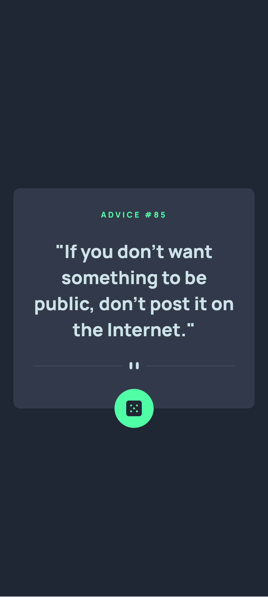
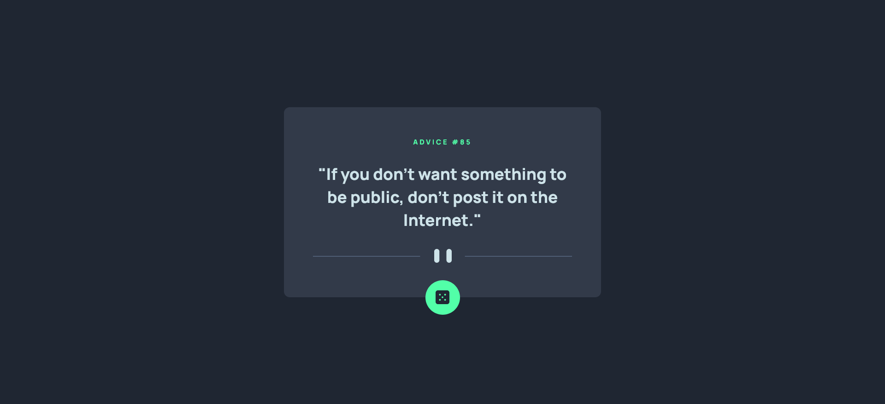

# Frontend Mentor: solución de aplicación generadora de consejos

Esta es una solución al [desafío de la aplicación generadora de consejos en Frontend Mentor] (https://www.frontendmentor.io/challenges/advice-generator-app-QdUG-13db). Los desafíos de Frontend Mentor lo ayudan a mejorar sus habilidades de codificación mediante la creación de proyectos realistas.

## Tabla de contenido

- [Resumen](#resumen)
    - [El desafío](#el-desafío)
    - [Captura de pantalla](#captura-de-pantalla)
    - [Enlaces](#enlaces)
- [Autor](#autor)

## Descripción general

### El reto

Los usuarios deberían poder:

- Ver el diseño óptimo para la aplicación según el tamaño de pantalla de su dispositivo
- Ver estados de desplazamiento para todos los elementos interactivos en la página
- Genera un nuevo consejo haciendo clic en el ícono del dado

### Captura de pantalla

#### Diseño Mobil

#### Diseño Desktop

### Enlaces

- URL de la solución: [Github](https://github.com/jean266/generador-de-consejos.git)
- URL del sitio en vivo: [Vencel](https://generador-de-consejos.vercel.app/)

## Mi proceso

### Construido con

- Marcado semántico HTML5
- Flexbox
- Flujo de trabajo móvil primero
- POO
- GULP
- SASS
- Modulos
- [adviceslip](https://api.adviceslip.com/advice) - Generador de consejos

## Autor

- Mentor de frontend - [@jean266](https://www.frontendmentor.io/profile/jean266)